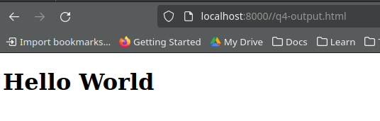

# Ouput of the tests

## q1.js

Before swapping: x=Apple, y=10  
Result from  swap("Apple", 10): -1  

Before swapping: x=9, y=17  
After swapping: x=17, y=9  
Result from  swap(9, 17): 0

## q2.js

[ 'John', 'Mary', 'Mark' ]

## q3.js

dog { breed: 'dog' }

## q4.js

## q5.js

Hello, my name is Jane and I love swimming.

